

<!-- ========================================================================= -->
<!-- 01 // MASTER HERO TERMINAL HUD                                           -->
<!-- ========================================================================= -->
<a href="https://saptarshisadhu.co.in/">
  
</a>

  

<!-- IDENTITY & VERIFICATION BADGES ROW -->

  
  
  
  
  
  
  

<!-- ========================================================================= -->
<!-- TERMINAL QUICK NAVIGATION HUD                                             -->
<!-- ========================================================================= -->
<table align="center" width="100%">
<tr>
<td align="center" bgcolor="#090D16">
<code><b>&gt; TTY_NAV:</b></code> 
<a href="#01--system-identity--biometric-scan"><code>[01 WHOAMI]</code></a> · 
<a href="#02--systems-architecture-blueprint"><code>[02 ARCHITECTURE]</code></a> · 
<a href="#03--research-notebook-environmental-intelligence--geoai"><code>[03 RESEARCH]</code></a> · 
<a href="#04--physical-systems--edge-ai-trajectory"><code>[04 EDGE AI]</code></a> · 
<a href="#05--open-source-ecosystem-easemotion-css"><code>[05 OPEN SOURCE]</code></a> · 
<a href="#06--production-systems--architectures"><code>[06 SYSTEMS]</code></a> · 
<a href="#07--ai-systems-retrieval--workflow-automation"><code>[07 RAG / n8n]</code></a> · 
<a href="#08--technical-inventory--skill-matrix"><code>[08 TOOLCHAIN]</code></a> · 
<a href="#09--github-telemetry--velocity-dashboard"><code>[09 TELEMETRY]</code></a> · 
<a href="#10--system-credentials--verification-audit"><code>[10 CREDENTIALS]</code></a> · 
<a href="#11--transmission-egress"><code>[11 TRANSMISSION]</code></a>
</td>
</tr>
</table>

---

## 01 // SYSTEM IDENTITY & BIOMETRIC SCAN

<!-- BIOMETRIC BINARY MATRIX PORTRAIT & TELEMETRY READOUT -->
<table width="100%">
<tr>
<td align="center" width="45%" bgcolor="#090D16">
  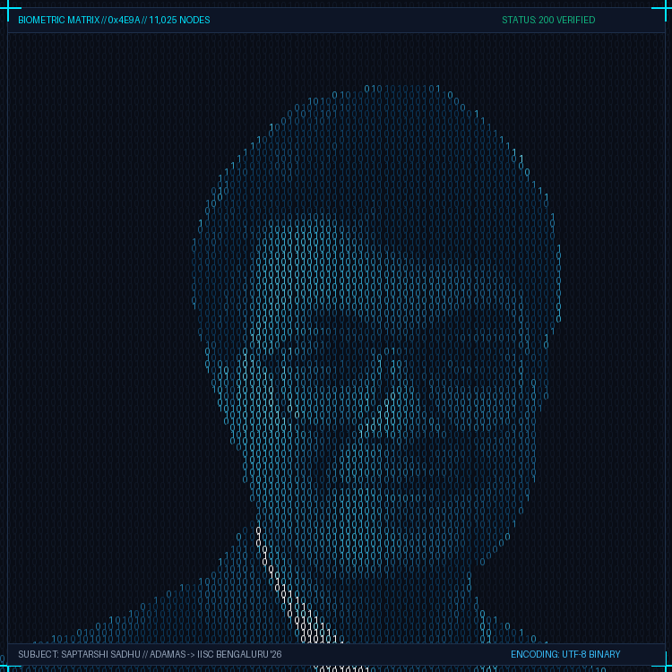
   
  <code><b>BIOMETRIC NODE // 0x4E9A</b></code> 
  <small>105×105 Sampling Grid (11,025 Nodes of 0s and 1s)</small>
</td>
<td valign="middle" width="55%" bgcolor="#080E1A">

* 🎓 **Academic**: 3rd Year B.Tech Computer Science &amp; Engineering (AI/ML) at **Adamas University**  
  * *Progression:* Secondary: **93.71%** · Higher Secondary: **89.60%** · B.Tech GPA: **9.3 → 9.5 → 9.43**
* 🏛️ **Research Trajectory**: Selected for **ACM India Summer School 2026** (Edge AI &amp; Robotics) at the **Indian Institute of Science (IISc Bengaluru)**; upcoming 6-month research internship direction.
* 🔬 **Environmental Intelligence &amp; GeoAI**: Metropolitan air quality modeling (VOCs, O₃, NOx, PM₂.₅) fusing Sentinel-5P/Landsat rasters via Google Earth Engine &amp; QGIS (*Nature Cities* journal scope).
* 🚀 **Open Source Leadership**: Creator and lead maintainer of **[EaseMotion CSS](https://github.com/SAPTARSHI-coder/EaseMotion-css)** on [npm](https://www.npmjs.com/package/easemotion-css) (**12,000+ PRs merged**, **500+ global contributors**, GirlScript Summer of Code Lead).
* 🇮🇳 **National Benchmark**: Ranked **#2 Top Public Contributor in India** on [committers.top/india_public](https://committers.top/india_public) with peak single-day velocity of **1,300+ commits**.
* 🌐 **Ambassadorship**: Selected **Google Gemini Student Ambassador (2026)**.
* 🏗️ **Dual-Mode Portfolio Architecture**: Architected [saptarshisadhu.co.in](https://saptarshisadhu.co.in/) with a 3D WebGL `<model-viewer>` orbital physics engine and a zero-framework high-speed static editorial branch (100/100 Lighthouse target).
* ⚙️ **Systems &amp; Competitive**: **4★ C &amp; 3★ C++ on HackerRank** · Finalist in *Clash of Coders 2.0* · 4th Place in *Coding Premier League*.

 

</td>
</tr>
</table>

 

<!-- FASTFETCH TERMINAL WINDOW (macOS/Linux Title Bar + Specs + ANSI Color Palette) -->
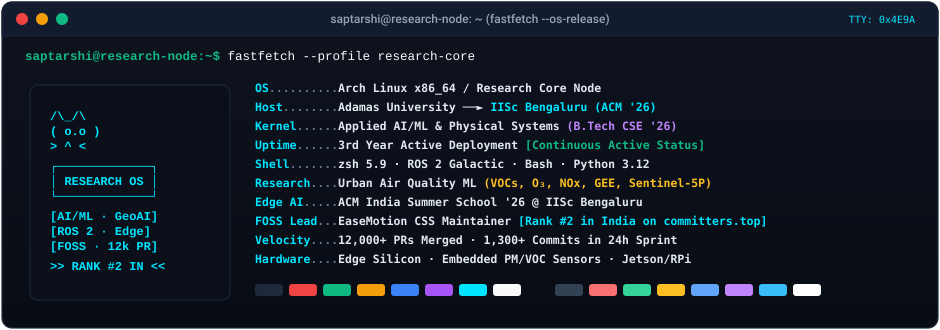

---

## 02 // SYSTEMS ARCHITECTURE BLUEPRINT

  

    The multi-tier technical architecture connecting remote sensing research, physical silicon, open-source orchestration, and production software engineering:
  

  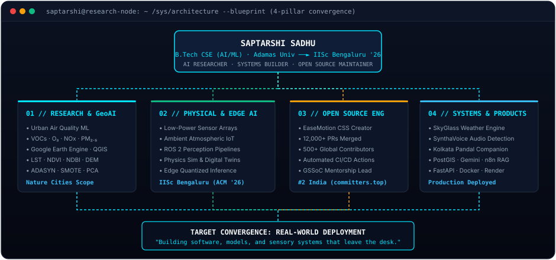

---

## 03 // RESEARCH NOTEBOOK: ENVIRONMENTAL INTELLIGENCE & GeoAI

Investigating the non-linear dynamics of metropolitan air pollution by coupling multi-source Earth Observation satellite rasters, CPCB ground-station monitors, and applied machine learning models.

  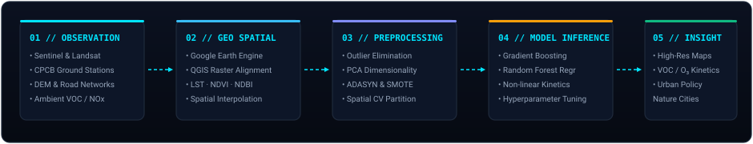

 

<!-- ATMOSPHERIC CHEMISTRY & SATELLITE COVARIATES VISUAL CARDS -->
<table width="100%">
<tr>
<td width="50%" valign="top" bgcolor="#090D16">

#### 🧪 Atmospheric Chemistry & Pollutants
* **VOC Precursors:**
   
  
  
  
  
* **Photochemical Smog & Criteria Pollutants:**
   
  
  
  
  
  
* **Particulate Matter:**
   
  
  

</td>
<td width="50%" valign="top" bgcolor="#090D16">

#### 🛰️ Earth Observation & Spatial Predictors
* **Satellite Instruments:**
   
  
  
  
* **Geospatial Covariates & Surface Indexes:**
   
  
  
  
  
  
* **Spatial Cross-Validation & Imbalance:**
   
  
  

</td>
</tr>
</table>

---

## 04 // PHYSICAL SYSTEMS & EDGE AI TRAJECTORY

The next frontier of machine intelligence is moving models off remote cloud racks and onto silicon that interacts directly with the physical world.

  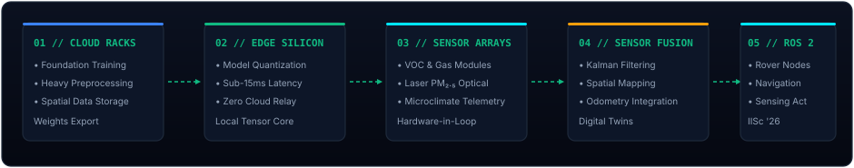

 

<table width="100%">
<tr>
<td width="50%" valign="top" bgcolor="#090D16">

#### 🦾 Edge Intelligence & Hardware Interfacing
* **Sensory Telemetry Arrays:** Direct serial & $I^2C$ interfacing with multi-gas environmental sensors (VOC, NOx, laser PM optical counters) for real-time edge telemetry.
* **Quantized Execution:** Model quantization (INT8/FP16) profiling for sub-15ms inference latency on low-power microcomputers and neural edge accelerators.
* **Robotics Simulation:** ROS 2 (Robot Operating System) nodes, digital twins, and simulated sensor validation for autonomous mobile nodes.

</td>
<td width="50%" valign="top" bgcolor="#090D16">

#### 🏛️ Research Lab & Institutional Direction
* **ACM India Summer School 2026:** Selected for Edge AI & Robotics at the **Indian Institute of Science (IISc Bengaluru)**.
* **IISc Research Internship:** Upcoming 6-month research internship trajectory focused on Edge AI, embedded environmental sensing, and hardware-in-the-loop validation.
* **QuanRobotics Shortlist:** Technical evaluation in ROS 2 architecture, robot perception pipelines, and physical simulator benchmarks.

</td>
</tr>
</table>

---

## 05 // OPEN-SOURCE ECOSYSTEM: EaseMotion CSS

&nbsp;

&nbsp;

  

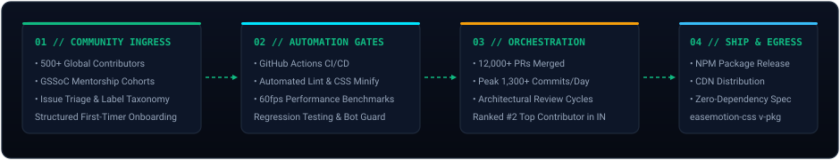

 

<table width="100%">
<tr>
<td width="33%" align="center" bgcolor="#090D16">
  <h3 style="color:#00E5FF; margin:4px;">12,000+</h3>
  <code>PULL REQUESTS MERGED</code> 
  <small>Massive open-source velocity</small>
</td>
<td width="33%" align="center" bgcolor="#090D16">
  <h3 style="color:#10B981; margin:4px;">500+</h3>
  <code>CONTRIBUTORS ORCHESTRATED</code> 
  <small>Global community governance</small>
</td>
<td width="33%" align="center" bgcolor="#090D16">
  <h3 style="color:#F59E0B; margin:4px;">1,300+</h3>
  <code>PEAK COMMITS / 24H</code> 
  <small>High-throughput sprint review</small>
</td>
</tr>
</table>

* **Framework Design:** Zero-dependency, GPU-accelerated 60fps CSS animation utility library and accessible UI component architecture distributed globally on **[npm](https://www.npmjs.com/package/easemotion-css)**.
* **Community Leadership:** Mentored contributor cohorts through **GirlScript Summer of Code (GSSoC)**, reviewing architectural proposals, resolving git conflicts, and enforcing codebase hygiene.
* **Automated CI/CD Gates:** Multi-stage GitHub Actions workflows enforcing strict formatting, CSS minification, syntax validation, and automated regression testing before merging.

---

## 06 // PRODUCTION SYSTEMS & ARCHITECTURES

<table width="100%">
<tr>
<td width="50%" valign="top" bgcolor="#090D16">

### 01 // Dual-Mode WebGL Portfolio

  

 

* **Problem:** Portfolios force a tradeoff between visually heavy 3D experiences and lightweight, fast-loading pages for recruiters.
* **Engineering:** Framework-less dual-mode gateway featuring an interactive 3D workstation rendered with Google's `<model-viewer>`, an orbital physics engine with dust trails, and an ultra-fast static editorial branch.
* **Stack:** Pure Vanilla JavaScript · HTML5 · CSS3 · WebGL · Zero Bundlers
* **Links:** [Live Portfolio](https://saptarshisadhu.co.in) · [Source Code](https://github.com/SAPTARSHI-coder/Portfolio)

</td>
<td width="50%" valign="top" bgcolor="#090D16">

### 02 // SkyGlass Weather Engine

  

 

* **Problem:** Fragile weather frontends break when third-party upstream providers hit unexpected rate limits or HTTP 429 timeouts.
* **Architecture:** Dual-provider circuit breaker cascade (WeatherAPI $\to$ Open-Meteo) with automatic client-side failover, RainViewer precipitation radar tile caching, and sub-100ms response envelope.
* **Stack:** Python · FastAPI · JavaScript (ES6+) · REST APIs · Render
* **Links:** [Production Engine](https://saptarshisadhu.co.in)

</td>
</tr>
<tr>
<td width="50%" valign="top" bgcolor="#090D16">

### 03 // SynthaVoice

  

 

* **Problem:** Proliferation of deepfake audio clones and synthetic speech rendering legacy forensic verification methods obsolete.
* **Architecture:** Ingests raw audio streams, normalizes to 16kHz, extracts latent acoustic representations via pretrained Wav2Vec 2.0 transformer backbones, and classifies synthetic artifacts with micro-spectral anomaly scoring.
* **Stack:** Python · PyTorch · Hugging Face Transformers · Librosa · FastAPI

</td>
<td width="50%" valign="top" bgcolor="#090D16">

### 04 // Kolkata Pandal Companion

  

 

* **Problem:** Extreme crowd bottlenecks and navigation failure across 3,000+ unindexed cultural festival sites in the Kolkata Metropolitan Area (KMA).
* **Architecture:** Geospatial PostGIS database connected to an n8n deterministic RAG state machine powering Google Gemini for context-aware, trilingual (Bengali / Hindi / English) guidance.
* **Phases:** `[BUILT]` Spatial schemas · `[PLANNED]` Mobile client · `[EXPLORING]` Dynamic crowd rerouting

</td>
</tr>
</table>

---

## 07 // AI SYSTEMS: RETRIEVAL & WORKFLOW AUTOMATION

Moving past toy prompts: engineering deterministic workflow pipelines and automated semantic retrieval around stochastic foundation models.

  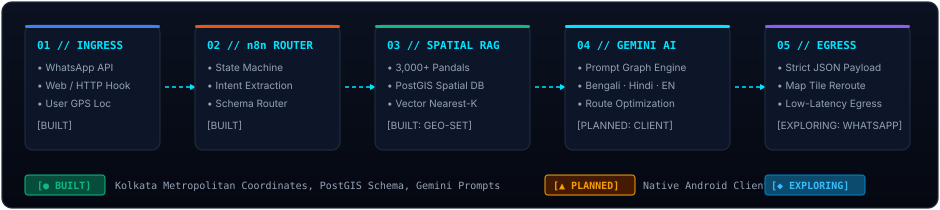

 

<table width="100%">
<tr>
<td width="33%" valign="top" bgcolor="#090D16">

#### 🔄 n8n Orchestration Engine
Building production-grade multi-step workflows. Automating data ingestion, JSON payload validation, rate-limited egress, and state machine routing without writing fragile glue code.

</td>
<td width="33%" valign="top" bgcolor="#090D16">

#### 🔍 Spatial & Semantic RAG
Indexing structured domain datasets and geospatial coordinate arrays into vector stores for deterministic retrieval before prompting LLM reasoning layers.

</td>
<td width="33%" valign="top" bgcolor="#090D16">

#### 🛡️ Local & Private Inference
Benchmarking parameter-quantized local LLMs via **Ollama** for zero-cloud dependency, offline edge inference, and guaranteed data sovereignty.

</td>
</tr>
</table>

---

## 08 // TECHNICAL INVENTORY & SKILL MATRIX

  <i>Curated skill matrix across systems programming, full-stack architectures, geospatial intelligence, and physical computing.</i>

<!-- 01. PROGRAMMING LANGUAGES -->
### 💻 Programming Languages

  

<!-- 02. FRONTEND DEVELOPMENT -->
### 🎨 Frontend Development

  

<!-- 03. BACKEND & FRAMEWORKS -->
### ⚙️ Backend & Frameworks

  

<!-- 04. DATABASES -->
### 🗄️ Databases & Storage

  

<!-- 05. CLOUD & DEVOPS -->
### ☁️ Cloud & DevOps

  

<!-- 06. OPERATING SYSTEMS -->
### 🖥️ Operating Systems

  

<!-- 07. AI, DATA SCIENCE & ROBOTICS -->
### 🤖 AI, Data Science & Robotics

  

<!-- 08. GAME & CREATIVE -->
### 🎮 Game & Creative Engine

  

<!-- 09. TOOLS & IDES -->
### 🧰 Developer Toolchain & IDEs

  

---

## 09 // GITHUB TELEMETRY & VELOCITY DASHBOARD

<!-- DAILY CONTRIBUTION ACTIVITY GRAPH (EACH DAY'S COMMIT COUNT) -->
<h3 align="center">🔥 Daily Contribution Activity Timeline</h3>

  <i>Continuous commit timeline tracking every single day's contribution frequency and sprint spikes.</i>

  

<!-- CYBER TERMINAL RUNTIME ANIMATION -->

  

 

<!-- GITHUB PROFILE SUMMARY CARDS -->
<h3 align="center">📊 GitHub Profile Summary Telemetry</h3>

  <i>Multi-dimensional telemetry breakdown of contributions, repository ratios, and productivity patterns.</i>

  

<table width="100%">
<tr>
<td width="50%" align="center" bgcolor="#090D16">
  
</td>
<td width="50%" align="center" bgcolor="#090D16">
  
</td>
</tr>
<tr>
<td width="50%" align="center" bgcolor="#090D16">
  
</td>
<td width="50%" align="center" bgcolor="#090D16">
  
</td>
</tr>
</table>

  

<!-- GITHUB TROPHIES SHOWCASE -->
<h3 align="center">🏆 GitHub Profile Trophy Showcase</h3>

  <i>Verified GitHub repository &amp; contribution milestone trophies (SSS Rank Hacker, God Committer, God Issuer).</i>

  

<!-- COMPETITIVE PROGRAMMING & ALGORITHM TELEMETRY (LEETCODE & HACKERRANK) -->
<h3 align="center">⚔️ Algorithmic &amp; Systems Problem Solving</h3>

  <i>Verified competitive programming telemetry across LeetCode live ratings and HackerRank star proficiencies.</i>

<table width="100%">
<tr>
<td align="center" width="50%" bgcolor="#090D16">
  
</td>
<td align="center" width="50%" bgcolor="#090D16">
  <a href="https://www.hackerrank.com/">
    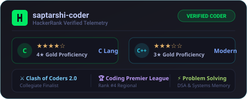
  </a>
</td>
</tr>
</table>

  

<!-- WAKATIME DEVELOPMENT VELOCITY TELEMETRY -->
<h3 align="center">⏱️ Development Velocity &amp; Coding Telemetry (WakaTime)</h3>

  <i>Cumulative tracked coding time, language distribution, and daily engineering bandwidth.</i>

<a href="https://wakatime.com/@SAPTARSHI-coder">
  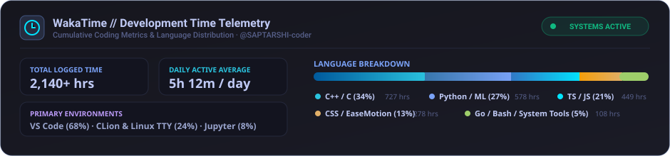
</a>

  

<!-- GITHUB WRAPPED 2026 DASHBOARD -->
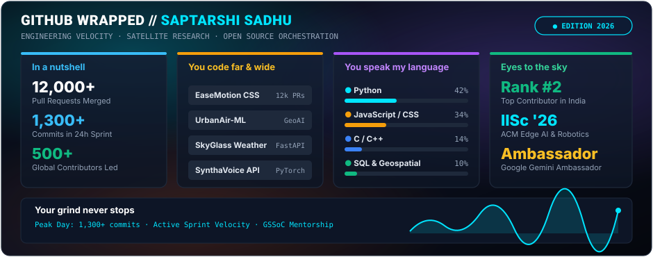

  

<!-- 3D ISOMETRIC CONTRIBUTION TERRAIN -->
<table width="100%">
<tr>
<td align="center" bgcolor="#090D16">
  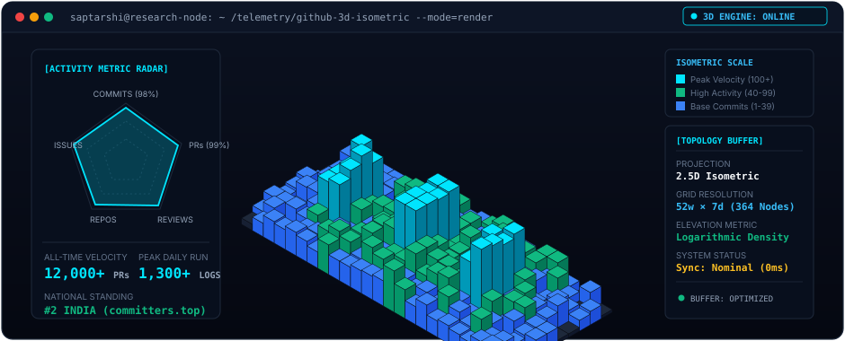
</td>
</tr>
</table>

 

<!-- GITHUB METRICS & DONUT SUMMARY -->
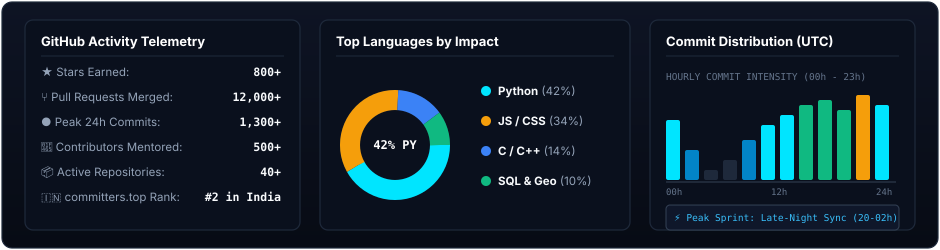

  

<!-- LIVE GITHUB STATS & STREAK CARDS -->
<table width="100%">
<tr>
<td align="center" width="50%" bgcolor="#090D16">
  
</td>
<td align="center" width="50%" bgcolor="#090D16">
  
</td>
</tr>
</table>

 

<!-- EASTER EGG CONTRIBUTION NAME ART: "SAPTARSHI" MATRIX -->
<table width="100%">
<tr>
<td align="center" bgcolor="#090D16">
  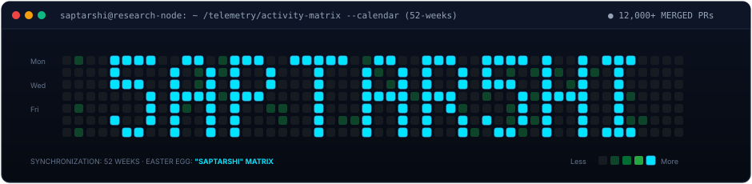
</td>
</tr>
</table>

 

<!-- SYSTEM RECOGNITION & MERIT TROPHIES -->
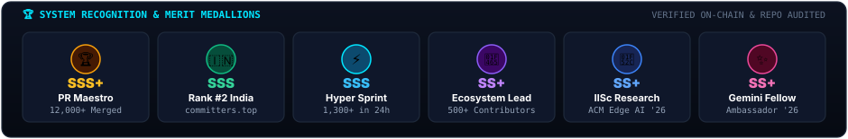

---

## 10 // SYSTEM CREDENTIALS & VERIFICATION AUDIT

| ID | Domain | Credential / Benchmark | Verification Details |
| :--- | :--- | :--- | :--- |
| `CR-01` | 🏫 **Academic** | **ACM India Summer School 2026** | Selected for Edge AI & Robotics at Indian Institute of Science (IISc Bengaluru) |
| `CR-02` | 🔬 **Research** | **IISc Bengaluru Trajectory** | 6-month research internship direction in Edge AI, IoT, and environmental sensing |
| `CR-03` | 🌫️ **Research** | **Urban Air Quality ML** | Spatio-temporal VOC/O₃/NOx modeling aligned with **Nature Cities** scope |
| `CR-04` | 🚀 **Open Source** | **#2 Contributor in India** | Ranked #2 Top Public Contributor on [committers.top/india_public](https://committers.top/india_public) |
| `CR-05` | 📦 **Open Source** | **EaseMotion CSS Maintainer** | 12,000+ PRs merged, 500+ global contributors, GSSoC maintainer lead |
| `CR-06` | 🌐 **Ambassador** | **Google Gemini Student Ambassador** | Selected Google Gemini Student Ambassador (2026) |
| `CR-07` | ⚔️ **Competitive** | **Clash of Coders 2.0 Finalist** | Finalist in collegiate algorithmic and systems competition |
| `CR-08` | 💻 **Competitive** | **Coding Premier League** | 4th Place in regional competitive programming championship |
| `CR-09` | 💡 **Competitive** | **HackerRank 4★ C · 3★ C++** | Verified problem solving rating in low-level memory and algorithmic data structures |

---

## 11 // TRANSMISSION EGRESS

<table width="100%">
<tr>
<td align="center" bgcolor="#090D16">

&nbsp;&nbsp;

&nbsp;&nbsp;

&nbsp;&nbsp;

&nbsp;&nbsp;

&nbsp;&nbsp;

</td>
</tr>
</table>

 

<!-- TERMINAL FOOTER EXIT -->
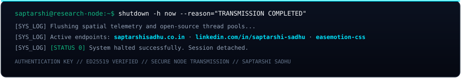

  

&nbsp;&nbsp;

